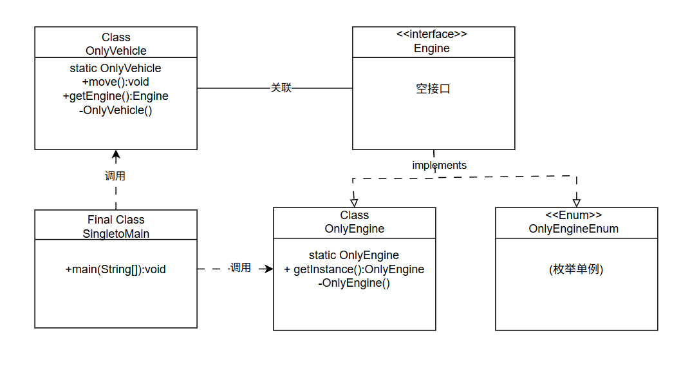

刘家傲-302023315369-软件工程2305-单例模式分析报告
# 单例模式 (Singleton Pattern) 实验分析

## 一、类图



### 关系说明

| 关系 | 箭头 | 线型 | 说明 |
|------|------|------|------|
| OnlyEngine 实现 Engine | 空心三角 | 虚线 | 实现接口 |
| OnlyEngineEnum 实现 Engine | 空心三角 | 虚线 | 实现接口 |
| OnlyVehicle 关联 Engine | 无（字段引用） | 实线 | 持有 engine 成员变量 |
| SingletonMain 依赖上述类 | 普通箭头 | 虚线 | 仅在 main() 方法内临时使用 |

---

## 二、各文件代码分析

### 1. Engine.java — 引擎接口

```java
interface Engine { }
```

- 角色：抽象层接口（标记型接口）
- 作用：定义引擎的抽象规范，使高层模块（OnlyVehicle）不依赖具体实现，符合依赖倒置原则 (DIP)。
- 当前为空接口，仅作为类型约束使用。

### 2. OnlyEngine.java — 懒汉式单例

```java
class OnlyEngine implements Engine {
    private static OnlyEngine INSTANCE;
    static OnlyEngine getInstance() {
        if (INSTANCE == null) {
            INSTANCE = new OnlyEngine();
        }
        return INSTANCE;
    }
    private OnlyEngine() {}
}
```

- 单例方式：懒汉式 (Lazy Initialization)
- 创建时机：首次调用 getInstance() 时才创建实例（延迟加载）
- 线程安全：不安全。多线程并发调用时，if (INSTANCE == null) 判断可能同时通过，导致创建多个实例。
- 私有构造器：阻止外部通过 new 创建对象。
- 改进方向：如果实际使用需要高并发，可加 synchronized 或使用双重检查锁定。

### 3. OnlyEngineEnum.java — 枚举单例

```java
enum OnlyEngineEnum implements Engine {
    INSTANCE
}
```

- 单例方式：枚举 (Enum Singleton)
- 创建时机：类加载时由 JVM 保证只创建一个实例
- 线程安全：天然安全，由 JVM 的枚举加载机制保证
- 优势：
  1. 代码最简洁（仅三行）
  2. 防反射攻击（构造器抛出异常）
  3. 防序列化破坏（枚举序列化由 JVM 保证单例）
  4. 这是 Joshua Bloch《Effective Java》推荐的最佳单例实现方式
- 在 OnlyVehicle 构造器中第 12 行作为备选方案被注释：//this.engine = OnlyEngineEnum.INSTANCE;

### 4. OnlyVehicle.java — 饿汉式单例 + 组合 Engine

```java
class OnlyVehicle {
    private static OnlyVehicle INSTANCE = new OnlyVehicle();
    static OnlyVehicle getInstance() { return INSTANCE; }
    private final Engine engine;

    private OnlyVehicle() {
        this.engine = OnlyEngine.getInstance();
        // this.engine = OnlyEngineEnum.INSTANCE;  // 可灵活切换实现
    }

    void move() { System.out.println("OnlyVehicle, move"); }
    Engine getEngine() { return engine; }
}
```

- 单例方式：饿汉式 (Eager Initialization)
- 创建时机：类加载时立即创建实例
- 线程安全：安全，类加载器本身是线程安全的。
- 组合关系：持有 final Engine 引用，在构造时通过 OnlyEngine.getInstance() 获取并固定，体现"一辆车只有一个引擎"的语义。
- 灵活性：注释的 OnlyEngineEnum.INSTANCE 表明可通过切换实现类来更换单例获取方式，体现面向接口编程的好处。

### 5. SingletonMain.java — 测试入口

```java
final class SingletonMain {
    public static void main(String[] args) {
        System.out.println("Pattern Singleton: only one engine");
        var engine = OnlyEngine.getInstance();
        var vehicle = OnlyVehicle.getInstance();

        vehicle.move();
        System.out.println("""
            OnlyEngine:'%s', equals with vehicle:'%s'"""
                .formatted(engine, (vehicle.getEngine().equals(engine))));
    }
}
```

运行流程：

1. 获取 OnlyEngine 单例实例
2. 获取 OnlyVehicle 单例实例（内部构造时也会获取同一个 OnlyEngine 实例）
3. 调用 vehicle.move() 输出 "OnlyVehicle, move"
4. 使用文本块格式化输出，验证两个路径拿到的 Engine 是否为同一个对象（预期 true）

输出：

```
Pattern Singleton: only one engine
OnlyVehicle, move
OnlyEngine:'OnlyEngine@28d93b30', equals with vehicle:'true'
```

---

## 三、核心设计思想

1. 单例模式目的：确保某个类在整个系统中只有一个实例，并提供全局访问点。
2. 本例语义：系统中仅有一台引擎、一辆车，且车与引擎是强绑定的一对一关系。
3. 面向接口编程：通过 Engine 接口解耦，OnlyVehicle 不直接依赖具体实现，可灵活切换 OnlyEngine 或 OnlyEngineEnum。
4. 私有构造器：所有单例类的构造器均为 private，防止外部直接 new。
