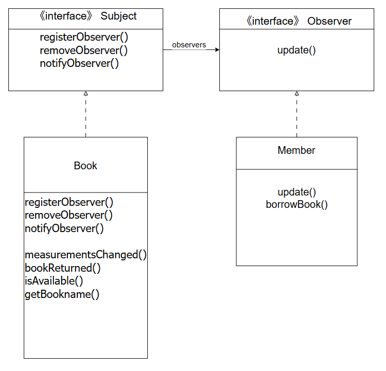
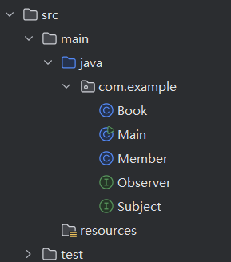

### 刘家傲 302023315369 软件工程2305

# 实验二 观察者模式 实验报告
## 一、实验背景
#### 以图书馆管理系统为背景。观察者基本上是图书馆的成员，他们有兴趣借书。当请求的书籍可用时，将使用观察者设计模式通知他们。

## 二、类图及设计
### 2.1 类图


### 2.2 设计
#### 观察者模式的套路非常固定与标准，只需抓住4个核心角色：

- Subject
- Observer
- 注册/移除/通知 三个方法
- 状态变化 → 自动触发通知

#### 即可完成图书馆借阅书籍的场景。

## 三、代码编写
### 3.1 业务流程
1. 成员（Member）借阅Book
2. 书籍初始状态为已借出
3. 后台操作（或定时任务）将书籍状态改为可借
4. Book自动通知所有等待的Member
5. 成员收到通知，执行借书动作

### 3.2 目录结构


### 3.3 类的编写

#### 3.3.1 Book类
```java
package com.example;

import java.util.ArrayList;
public class Book implements Subject {
    private ArrayList observers;
    private String bookName;
    private String author;
    private String edition;
    private boolean isAvailable;


    public Book(String bookName, String author, String edition,boolean isAvailable) //构造方法
    {
        this.bookName = bookName;
        this.author = author;
        this.edition = edition;
        this.isAvailable = isAvailable;
        observers = new ArrayList();
    }

    public Book(){
        bookName = "";
        author = "";
        edition = "";
        isAvailable = false;
        observers = new ArrayList();
    }


    public void registerObserver(Observer o) {
        observers.add(o);
    }

    public void removeObserver(Observer o) {
        int i = observers.indexOf(o);
        if (i >= 0) {
            observers.remove(i);
        }
    }

    public void notifyObservers() {
        for (int i = 0; i < observers.size(); i++) {
            Observer observer = (Observer) observers.get(i);
            observer.update(bookName, author, edition,isAvailable);
        }
    }

    public void measurementsChanged() {
        notifyObservers();
    }

    public void setMeasurements(String bookName, String author, String edition, boolean isAvailable) {
        this.bookName = bookName;
        this.author = author;
        this.edition = edition;
        measurementsChanged();
    }

    public void bookReturned() {
        this.isAvailable = true;
        System.out.println("\n【系统消息】：《" + bookName + "》已归还入库！");
        notifyObservers();
    }

    public boolean isAvailable() {
        return isAvailable;
    }

    public String getBookName() {
        return bookName;
    }

}
```

#### 3.3.2 Member类
```java
package com.example;

public class Member implements Observer {
    private String name; // 成员姓名

    public Member(String name) {
        this.name = name;
    }

    @Override
    public void update(String bookName, String author, String edition, boolean isAvailable) {
        if (isAvailable) {
            System.out.println(name + " 收到通知：《" + bookName + "》可以借阅了！");
            borrowBook(bookName);
        }
    }
    
    private void borrowBook(String bookName) {
        System.out.println(name + " 成功借阅了《" + bookName + "》！\n");
    }

}
```

#### 3.3.3 Observer接口
```java
package com.example;

public interface Observer {
    public void update(String bookName, String author, String edition,boolean isAvailable);
}
```

#### 3.3.4 Subject接口
```java
package com.example;

public interface Subject {
    public void registerObserver(Observer o);
    public void removeObserver(Observer o);
    public void notifyObservers();
}
```

#### 3.3.5 主函数
```java
package com.example;

public class Main {
    public static void main(String[] args) {
        // 1. 创建具体的书籍（主题）
        Book journeyBook = new Book("西游记","吴承恩","第一版",false);
        Book aloneBook = new Book("百年孤独","加西亚·马尔克斯","第一版",false);

        // 2. 创建具体的成员（观察者）
        Member memberA = new Member("刘华强");
        Member memberB = new Member("马冬梅");
        Member memberC = new Member("何塞");

        // 3. 成员订阅书籍
        journeyBook.registerObserver(memberA);
        journeyBook.registerObserver(memberB);

        aloneBook.registerObserver(memberA);
        aloneBook.registerObserver(memberC);

        // 4. 模拟一段时间后，书籍还没回来（无通知）
        System.out.println("--- 模拟运行一段时间，书籍还在被借阅中 ---");
        System.out.println("当前状态：《西游记》是否可借？ " + journeyBook.isAvailable());
        System.out.println("成员们暂时收不到通知。\n");

        // 5. 关键动作：书籍被归还了，触发通知机制
        System.out.println("--- 时间流逝，工作人员操作归还 ---");
        journeyBook.bookReturned();
        aloneBook.bookReturned();
    }
}
```

## 四、运行结果

```java
--- 模拟运行一段时间，书籍还在被借阅中 ---
当前状态：《西游记》是否可借？ false
成员们暂时收不到通知。

        --- 时间流逝，工作人员操作归还 ---

        【系统消息】：《西游记》已归还入库！
刘华强 收到通知：《西游记》可以借阅了！
刘华强 成功借阅了《西游记》！

马冬梅 收到通知：《西游记》可以借阅了！
马冬梅 成功借阅了《西游记》！


        【系统消息】：《百年孤独》已归还入库！
刘华强 收到通知：《百年孤独》可以借阅了！
刘华强 成功借阅了《百年孤独》！

何塞 收到通知：《百年孤独》可以借阅了！
何塞 成功借阅了《百年孤独》！


进程已结束，退出代码为 0
```

## 五、总结

#### 该案例的核心思路为：
- Subject (被观察目标)：Book (书籍)。它维护一个观察者列表，当书籍状态变 “可借” 时，通知所有观察者。
- Observer (观察者)：Member (图书馆成员)。订阅感兴趣的书籍，收到通知后前来借阅。

#### 感觉称其为通知者模式更容易理解。