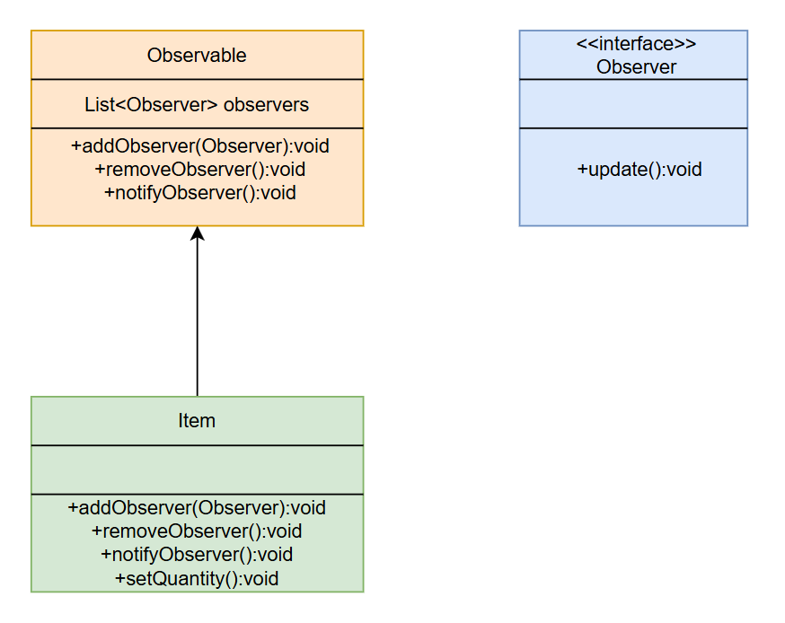

### 302023315369_刘家傲_设计模式分析报告

# 一、引言

模块选择：
Stendhal 游戏物品状态通知模块所采用的观察者模式。该模式用于处理游戏中物品（Item） 的状态变化（数量变化、属性修改、使用、丢弃等），并为后续扩展监听机制提供统一架构支持。


# 二、核心功能说明

1. 当物品（Item） 状态发生改变时，可主动发出事件通知。
2. 项目提供标准接口，允许后续增加对物品状态感兴趣的观察者进行监听。
3. 实现物品状态发布者与观察者解耦，新增监听逻辑无需修改物品类源码。

# 三、设计模式分析

## 3.1 观察者模式简介
在游戏开发中，物品会频繁发生状态变化，例如：
1. 物品数量增减
2. 物品被使用、被丢弃、被装备
3. 物品属性修改

若不使用观察者模式：
1. 物品类需要硬编码调用各类业务逻辑，代码高度耦合。
2.  新增监听功能必须修改物品类，违反开闭原则。
3. 代码难以维护、扩展、复用。

观察者模式用于**定义对象间一对多的依赖关系**，当一个对象状态发生变化时，所有依赖它的对象都会自动收到通知并更新。

**模式角色与项目真实类对应表**
设计模式角色 | Stendhal 中的类
:-:|:-:
抽象主题|Observable
抽象观察者|Observer 接口
具体主题|继承 Observable 的类  Item
具体观察者| 实现 Observer 接口的类（在代码仓库中未发现）
## 3.2 关键代码佐证
### 3.2.1 抽象观察者：Observer.java
```java
package games.stendhal.server.util;

public interface Observer {
    void update(Observable o, Object arg);
}
```
作用：定义所有观察者必须实现的方法：
**update(Observable o, Object arg)**
当被观察者状态改变时，被自动调用。

### 3.3.2 抽象主题：Observable.java
```java
package games.stendhal.server.util;

import java.util.ArrayList;
import java.util.List;

public class Observable {
    // 保存所有观察者
    private List<Observer> observers = new ArrayList<>();

    // 注册观察者
    public void addObserver(Observer observer) {
        if (!observers.contains(observer)) {
            observers.add(observer);
        }
    }

    // 移除观察者
    public void removeObserver(Observer observer) {
        observers.remove(observer);
    }

    // 通知所有观察者
    public void notifyObservers(Object arg) {
        for (Observer observer : observers) {
            observer.update(this, arg);
        }
    }
}
```
作用：
1. 维护观察者列表 observers
2. 提供 addObserver 注册观察者
3. 提供 removeObserver 移除观察者
4. 提供 notifyObservers 广播通知

### 3.3.3 具体被观察者:Item.java

```java
private final Observable observable = new Observable();

@Override
public void addObserver(Observer observer) {
	observable.addObserver(observer);
}

@Override
public void removeObserver(Observer observer) {
	observable.removeObserver(observer);
}

@Override
public void notifyObservers(Object arg) {
	observable.notifyObservers(arg);
}
```
Item 是项目中唯一真正使用观察者模式的具体类。
通过 **组合（委托）** 方式复用 Observable 能力。
当物品数量、状态变化时，可调用 notifyObservers() 发送通知。

# 四、UML类图
源代码中实现观察者模式的类图如下：



# 五、总结

本次作业我分析了 Stendhal 游戏源码中的观察者模式，项目在server.util包下提供了标准架构，包括抽象观察者Observer接口与抽象被观察者Observable类。在观察了源码后，我唯一真实发现的具体被观察者为Item物品类，其通过组合Observable实现了事件通知能力，可在状态变化时发送通知。值得注意的是，仓库中未发现任何实现Observer接口的具体观察者类，该模式仅完成被观察者端实现，观察者端为预留扩展点。此设计实现了物品状态与监听逻辑的解耦，符合开闭原则，为后续扩展 UI 刷新、任务检测等功能提供了统一入口，贴合游戏架构的灵活设计需求。